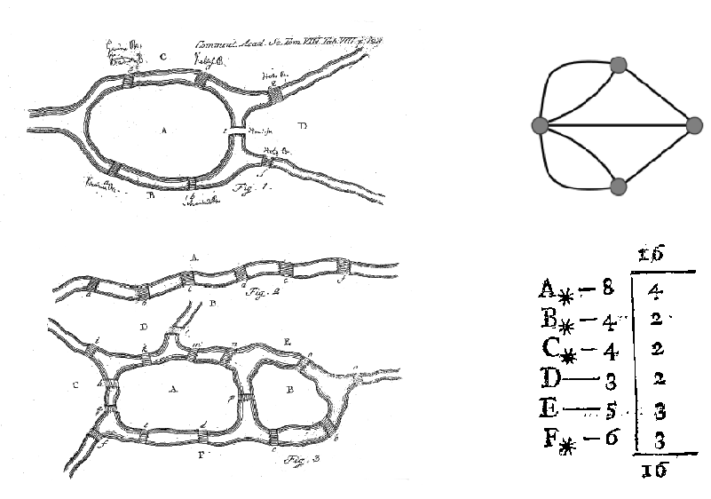
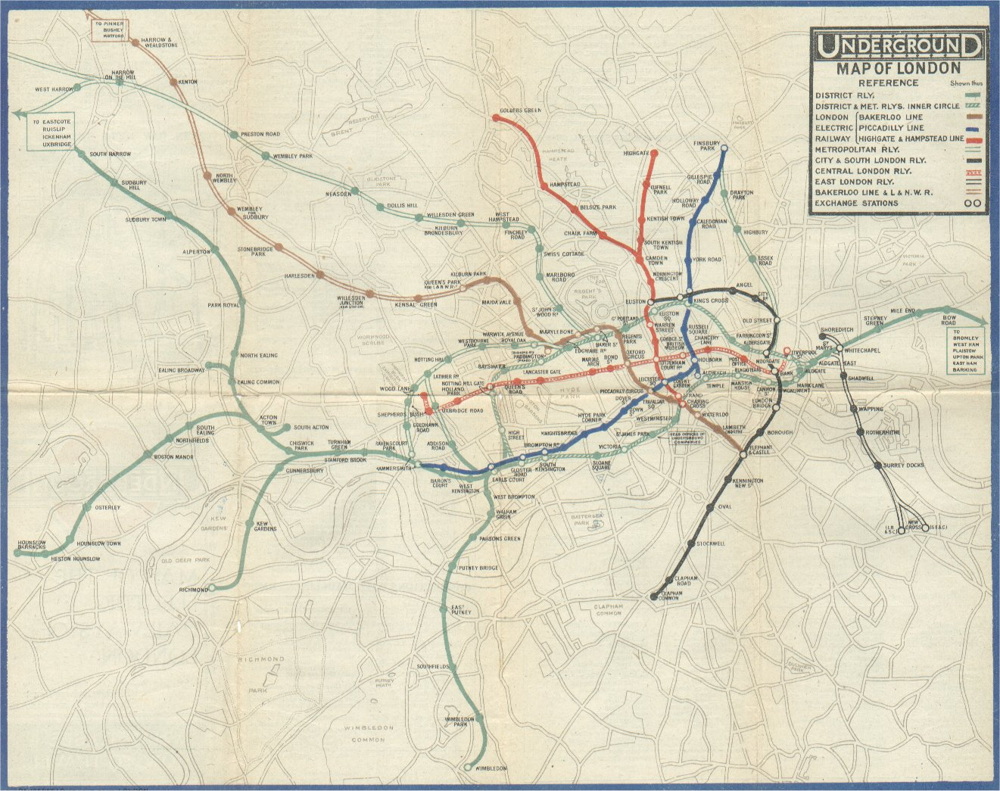
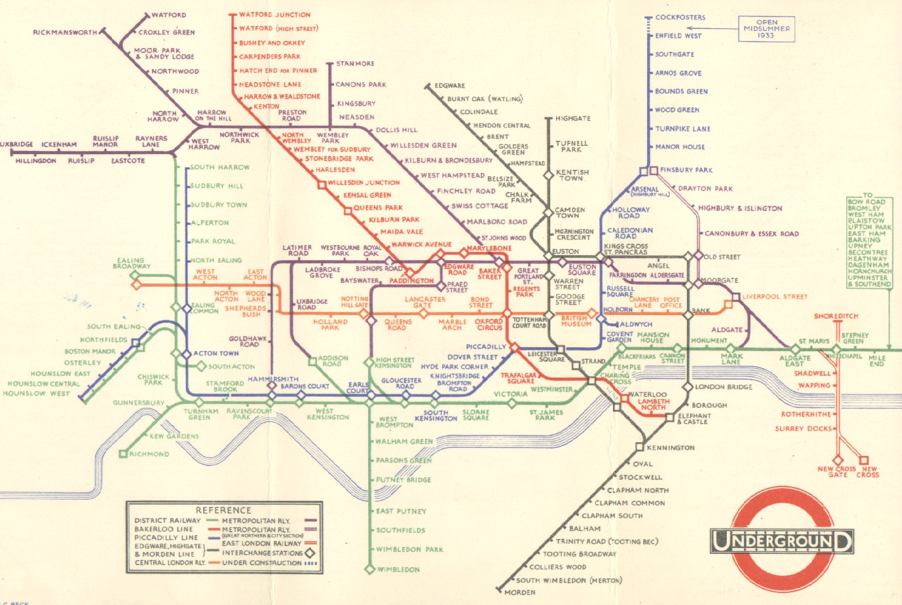
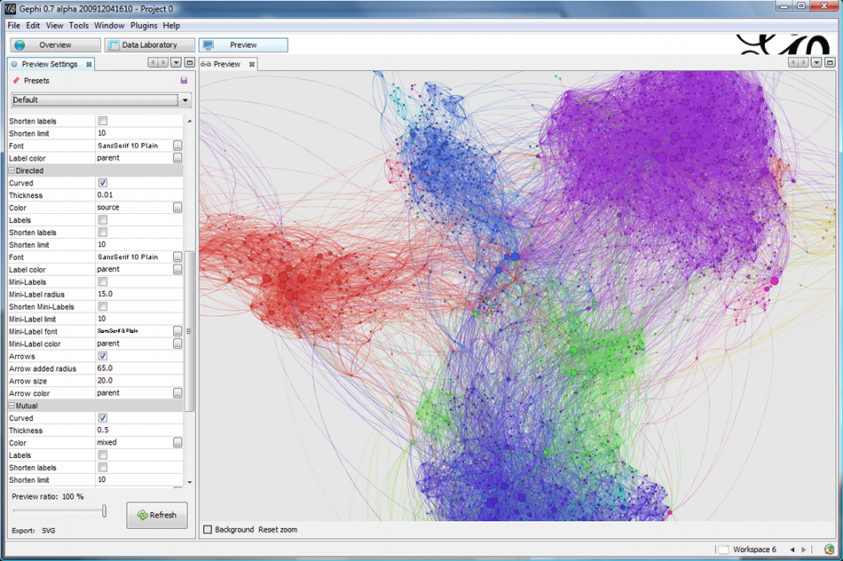

### visual network storytelling 
Paul Girard - Sciences Po médialab

---

Research center led by Bruno Latour  
specialized in studying society through digital traces.

[medialab.sciences-po.fr](http://www.medialab.sciences-po.fr)

---

## We love networks
- as graphs
- as maps
- as interfaces

---
## networks as graphs
  

---
## networks as maps 
 

---
## networks as maps 

---
## networks as interfaces

---
## Visual Network Analysis
- Use a spatialization algorithm (structure)
- Visualize categories as colors (content)
- analysid structure-content matchings
  
  
*Network Visualisation to do Exploratory Data Analysis!* <!-- .element: class="fragment" data-fragment-index="2"   -->

---
## Visual Network storytelling

---
## Visual Network storytelling
- on the web ?
- storytelling a network ?

---
<!-- .slide: data-background="#F0F8F8" -->
# Manylines
### in one line
web app to storify a network

---
<!-- .slide: data-background="#F0F8F8" -->
## live demo
- a webcrawl network about RIO+20
- created and qualified by Débora Pereira 
- analyse it in Gephi
- let's share our findings using [manylines](http://tools.medialab.sciences-po.fr/manylines)

---
<!-- .slide: data-background="#F0F8F8" -->
## storytelling style
- structure/content analysis
  - **coloring** : coloring node with metadata
  - **category impact** : filtering based on metada
- in-depth view
  - **pinpointing** : zoom to reveal details  

---
<!-- .slide: data-background="#F0F8F8" -->
## French trade in 18th century
On going research for [the TOFLIT18 project](http://toflit18.hypotheses.org/) 

---
<!-- .slide: data-background-iframe="http://tools.medialab.sciences-po.fr/manylines/embed#/narrative/4827de8f-568a-4b0f-af33-d78b5b0e3bfe" -->
[Toflit18 18th century french trade merchandises](http://tools.medialab.sciences-po.fr/manylines/embed#/narrative/4827de8f-568a-4b0f-af33-d78b5b0e3bfe)

---
<!-- .slide: data-background="#F0F8F8" -->
## a different storytelling style
- explain the **network model**
- **pinpointing** on wine to illustrate this model 
- **peer-to-peer exploration** to browse the wine cluster
- **back-to-source** by adding a picture in the commentary
- **thematic confrontation** to create a joke on Wine/Water
- **peer-to-peer exploration** from water to chemical
- **pinpointing** on data cleaning problems (gomme/gommes)
- **guided tour** of fabric cluster and some others
- **open to exploration**

---
<!-- .slide: data-background="#F0F8F8" -->

## Toward a visual grammar of networks
- there are *many **Story** lines*
- differences with Prezi : spatialisation is set not constructed
- stories are different path in the network spaciality
- write and replay exploration brings the opportunity of setting a grammar: 

**color, category impact, pinpointing, peer-to-peer exploration, back-to-source, thematic jump, guided tour, open to exploration**<!-- .elements: class="fragment" data-fragment-index="2"-->

---
<!-- .slide: data-background="#F0F8F8" -->

## to be continued
- manylines is a Proof of Concept
- a great tool to experiment with sharing network exploration
- but it needs Complete UI refactoring and redesign
- impressed by [oddysey.js](http://cartodb.github.io/odyssey.js) storytelling and design

---
## thank you
- explore [manylines narrative on  18th French trade goods](http://tools.medialab.sciences-po.fr/manylines/embed#/narrative/4827de8f-568a-4b0f-af33-d78b5b0e3bfe)  
- test [http://tools.medialab.sciences-po.fr/manylines/](http://tools.medialab.sciences-po.fr/manylines/)  
- this slides are at [http://medialab.github.io/manylines/ars2015/](http://medialab.github.io/manylines/ars2015/)  
